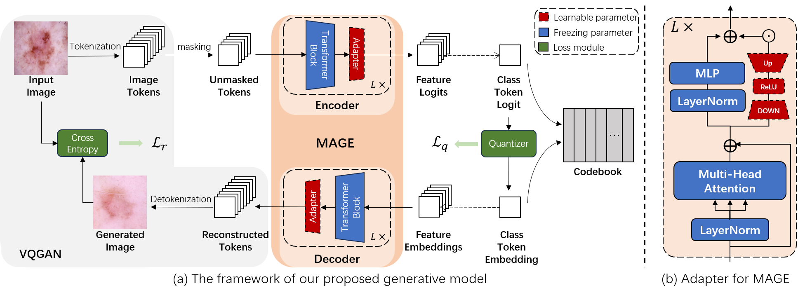

# Adapting Pre-trained Generative Model to Medical Image for Data Augmentation

<p align="center">
  
</p>
This is the official implementation for the MICCAI 2024 accepted paper "Adapting Pre-trained Generative Model to Medical Image for Data Augmentation"

## Abstract

Deep learning-based medical image recognition requires a
large number of expert-annotated data. As medical image data is often
scarce and class imbalanced, many researchers have tried to synthesize
medical images as training samples. However, the quality of the generated
 data determines the effectiveness of the method, which in turn is
related to the amount of data available for training. To produce highquality
 data augmentation in few-shot settings, we try to adapt largescale
 pre-trained generative models to medical images. Speciffcally, we
adapt MAGE (a masked image modeling-based generative model) as
the pre-trained generative model, and then an Adapter is implemented
within each layer to learn class-wise medical knowledge. In addition, to
reduce the complexity caused by high-dimensional latent space, we introduce
 a vector quantization loss as a constraint during ffne-tuning. The
experiments are conducted on three different medical image datasets.
The results show that our methods produce more realistic augmentation
samples than existing generative models, with whom the classiffcation
accuracy increased by 5.16%, 2.74% and 3.62% on the three datasets respectively.
 The results demonstrate that adapting pre-trained generative
models for medical image synthesis is a promising way in limited data
situations.

## Preparation
### Dataset
We used three medical image datasets, of which [HAM10000](https://www.kaggle.com/datasets/kmader/skin-cancer-mnist-ham10000) 
and [ODIR-5k](https://odir2019.grand-challenge.org/dataset/) are public datasets and can be downloaded.

### Installation
The core environment of the project is pytorch, PyTorch-Lightning and timm, and users can use the environment file provided by us to configure the environment

```
conda env create -f environment.yaml
conda activate vqmagemed
```

Download the pre-trained <a href="https://drive.google.com/file/d/13S_unB87n6KKuuMdyMnyExW0G1kplTbP/view?usp=sharing">VQGAN</a> 
tokenzier and the pre-trained <a href="https://drive.google.com/file/d/1Q6tbt3vF0bSrv5sPrjpFu8ksG3vTsVX2/view?usp=sharing">MAGE-B</a> 
model that are used in our project.

## Usage
### Train the generative model

```
python -m torch.distributed.launch --nproc_per_node=2 main_pretrain.py \
--batch_size 64 \
--model mage_vit_base_patch16 \
--checkpoint ${MAGE-B model path} \
--mask_ratio_min 0.5 --mask_ratio_max 1.0 \
--mask_ratio_mu 0.55 --mask_ratio_std 0.25 \
--epochs 1000 \
--warmup_epochs 40 \
--blr 1.5e-4 --weight_decay 0.05 \
--output_dir ${MODEL_OUTPUT_DIR} \
--data_path ${DATA_DIR} \
--category ${CATEGORY}
```

### Generate the images

```
python gen_img_uncond.py \
--num_images 10000 \
--ckpt ${MODEL_OUTPUT_CKPT} \
--output_dir ${GENERATE_IMAGES_DIR} \
```

### Evaluate the generation performance
Fill in ORIGINAL_IMAGES_PATH and GENERATED_IMAGES_PATH in the code, then quantitatively evaluate FID by
```
cd eval
python eval_generation.py
```

### Evaluate the augmentation performance
When the generated images are ready, evaluate the augmentation of the generated images by
```
cd eval
python eval_classification.py --backbone ${YOUR_BACKBONE_ENCODER} --dataset ${DATASET_NAME} --use_data ${train\train+synthetic}
--root1 ${ORIGINAL_TRAIN_IMAGES_ROOT} --root2 ${GENERATED_IMAGES_ROOT} test_root ${TEST_IMAGES_ROOT} --epoch ${EPOCH} 
--batch_size 4096 --im_size 256
```
The key parameter is use_data. When 'train' is selected, the result is the performance when only the original training set is used.
When 'train+synthetic' is selected, the result is the augmentation performance after including the generated data.

## Acknowledgement
This work is based on [MAGE](https://github.com/LTH14/mage), [benchmark_VAE](https://github.com/clementchadebec/benchmark_VAE), 
[Adaptformer](https://github.com/ShoufaChen/AdaptFormer). If you have any questions, please feel free to open an issue.

## Citation
If you find this work helpful for your project,please consider citing the following paper:
    @inproceedings{yuan2024adapting,
      title={Adapting Pre-trained Generative Model to Medical Image for Data Augmentation},
      author={Yuan, Zhouhang and Fang, Zhengqing and Huang, Zhengxing and Wu, Fei and Yao, Yu-Feng and Li, Yingming},
      booktitle={International Conference on Medical Image Computing and Computer-Assisted Intervention},
      pages={79--89},
      year={2024},
      organization={Springer}
    }
